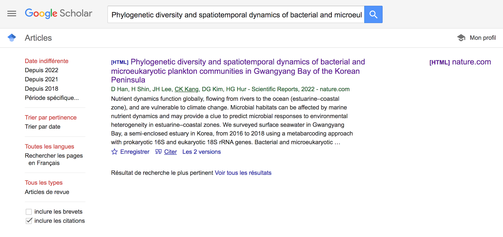
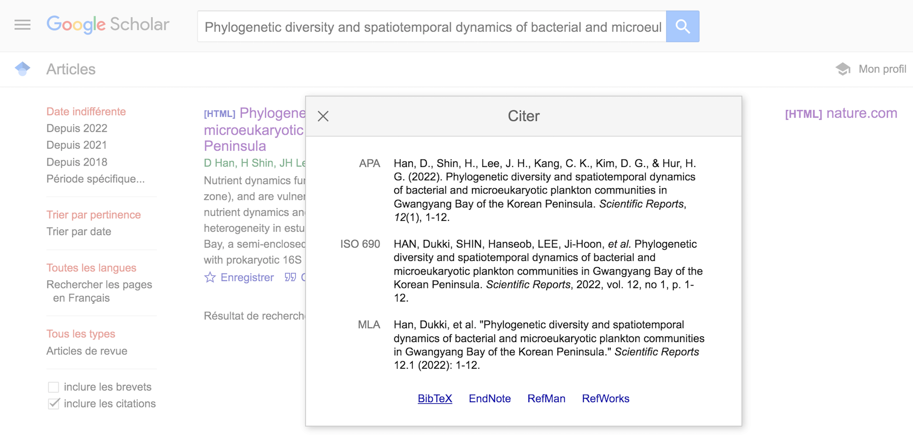
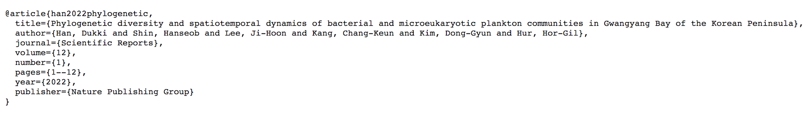

```{r setup}
knitr::opts_chunk$set(echo = TRUE)
knitr::opts_knit$set(root.dir = ".")
```

Let's now build a proper Rmarkdown document in which we are going to describe a few additional Rmarkdown useful features.

Before going into the details of Rmarkdown, look at the _r setup_ chunk. We added two global options:

- `knitr::opts_chunk$set(echo = TRUE)`: sets the value of the code chunk option `echo` to `TRUE` for all chunks, unless the user decides not to print the code chunk with `echo=FALSE`

- `knitr::opts_knit$set(root.dir = ".")`: sets the working directory. By default, the working directory for R code chunks is the directory that contains the Rmd document, so basically `knitr::opts_knit$set(root.dir = ".")` does nothing here. But it might be interesting for you to set another working directory depending on your files organization. We recommend **ALWAYS** set the working directory relatively to your `.Rmd` file! Thus, if you share your research compendium with someone else, this someone will be able to knit your `.Rmd` file without changing anything!

# Call libraries

```{r librairies, warning=FALSE, echo=FALSE}
library(ggplot2)
library(kableExtra)
library(readxl)
```

# Code-chunk options
Your [Rmarkdown cheat sheet](https://www.rstudio.com/wp-content/uploads/2016/03/rmarkdown-cheatsheet-2.0.pdf?_ga=2.102565186.2124518106.1645700734-42729368.1573809399) will be your best friend to fine tune the choice of these parameters.

## Few code-chunk options

```{r pressure1, echo=FALSE}
plot(pressure, xlab="Temperature", ylab="Pressure",type="l")
```

The code chunk options were : "r pressure1, echo=FALSE" <br/>
Here we have three elements: 

1. "r" and space (you can call other code language if necessary)
2. "chunk-name" and coma, give it the name you want, do not duplicate names otherwise Rmarkdown will print you an error message when building your document
3. the `echo = FALSE` parameter prevents the printing of the R code that generated the plot.

## Plotting code-chunk options

In the next example we added a few plotting options:
```{r pressure2, echo=TRUE, fig.align='center', fig.width=4, fig.height=3, fig.cap="Figure 2: my nicest plot ever"}
plot(pressure, xlab="Temperature", ylab="Pressure",type="l",col="red")
```

The code chunk options were : "r pressure2, echo=TRUE, fig.align='center', fig.width=4, fig.height=3, fig.cap="Figure 2: my nicest plot ever", fig.path="figures""

Here we have 7 elements: 

3. the `echo = TRUE` parameter now prints the R code that generated the plot.
4. the `fig.align='center'` is self-explanatory
5. the `fig.width=4`, is self-explanatory
6. `fig.height=3`, is self-explanatory
7. `fig.cap="Figure 2: my nicest plot ever"`, inserts a figure caption (a figure title)

Note, the figures are saved at the .png format, and at the requested size, in "./my_rmd_script.rmd/figure-html/"

## Verbose code-chunk options

Here I included an error in the script on purpose, lets see how it goes:
```{r pressure3, echo=TRUE, error=TRUE, include=TRUE, warning=TRUE}
#The following function is supposed to create a warning message
cor( c( 1 , 1 ), c( 2 , 3 ) )
plot(pressur, xlab="Temperature", ylab="Pressure",type="l",col="red")
```

The code chunk options were : "r pressure3, echo=TRUE, error=TRUE, include=TRUE, warning=TRUE"
Here we have 6 elements: 

3. the `echo = TRUE` parameter now prints off the R code that generated the plot.
4. the `error = TRUE` parameter now **prints error instead of killing the production of your output document** 
5. the `include = TRUE` parameter now prints off the code = redundant with echo
6. the `warning = TRUE` prints the warning messages

## Cache

If you have time-consuming chunks, you will be interested in **caching** them! Caching a code chunk means skipping the execution of this code chunk if it has been executed before and nothing in the code chunk has changed since then, so it will make you save a lot of time! 

```{r cache example, fig.width=3, fig.height=3, cache=TRUE}
# this code chunk will be evaluated only once, unless you modify the code chunk
ggplot(data = pressure, aes(x = temperature, y = pressure)) +
  geom_point(color = "pink") +
  labs(x = "Temperature (°C)", y = "Pressure (mm)") +
  theme_bw()
```

The code chunk options were : "r cache example, fig.width=3, fig.height=3, cache=TRUE"
Here we have 5 elements: 

5. the `cache=TRUE` parameter now **caches the result of this code chunk** 

# Tables with kableExtra

To produce tables with Rmarkdown, a useful package is `kableExtra`. Is takes advantage of the `kable()` function in `knitr`, which is a very simple table generator.

```{r pressure4}
kable(head(pressure))
```

This is a basic HTML output of `kable()`, which is a bit ugly! Let's see how to improve that.

The `kableExtra` syntax may be a bit different from what you are used to with R. It uses the pipe-like operator `%>%` from the `magrittr` package (you can have a look at this package [here](https://cran.r-project.org/web/packages/magrittr/vignettes/magrittr.html)). Thus, the following code is equivalent to the previous one:

```{r pressure5}
head(pressure) %>%
  kable()
```

In order to produce nicer tables, various themes are available in the `kableExtra` package, such as `kable_styling`, `kable_classic`, `kable_material_dark`. Let's observe the output of those themes:

```{r pressure6}
mytable = head(pressure) %>%
  kable(align = "cc")

mytable %>%
  kable_styling(full_width = FALSE)

mytable %>%
  kable_classic(full_width = FALSE, "hover", html_font = "Trebuchet MS", position = "left")

# you can even produce very ugly tables like this one:
mytable %>%
  kable_material_dark(font_size = 14, "striped") %>%
  row_spec(3:4, bold = T, color = "blue", background = "#D7261E")
```

Description of the options :

- `align = "cc"`: centers the content of the columns
- `full_width = FALSE`: prevents kable from printing the table on the whole width of the document
- `"hover"`: highlights the row where you hover
- `html_font = "Trebuchet MS"`: changes the font to Trebuchet MS
- `position = "left"`: places the table on the left
- `"striped"`: stripes the rows

`row_spec` is a function that allows to select rows and specify their look.

Many other options and functions make it easy to customize your tables, have a look at their [tutorial](https://haozhu233.github.io/kableExtra/awesome_table_in_html.html) (you might need it for the last exercise!).

# Working with Excel files

This is a parenthesis, not directly related to RMarkdown, but related to reproductibility. In many projects, your supervisor will feed you with an Excel table. You can read directly this table into R, without saving it in CSV, therefore avoiding a manual unrecorded unreproducible step. That can be done with the packake `readxl` (or with googlesheet4, for googlesheets). 

```{r iris_xls, echo=FALSE, error=FALSE, warning=FALSE, fig.width=7, fig.height=7}
my_iris <- as.data.frame(read_excel("data/datasets.xlsx", sheet = "iris"))
my_iris$Species<-as.factor(my_iris$Species)
summary(my_iris)
pairs(my_iris[1:4], main = "Edgar Anderson's Iris Data", pch = 21, bg = c("red", "green3", "blue")[unclass(my_iris$Species)])
```

Here we used the `read_excel` function, we specified `path` to the excel file and the excel `sheet` we want to open. We then encoded the species column as a factor.  

You can consult the [data-import cheat sheet](https://github.com/rstudio/cheatsheets/blob/main/data-import.pdf) for further help. 

# Header options

The global look of your Rmarkdown output document can be customized with the header components. A Rmarkdown header is written in **YAML**, which is a set of key-value pairs. It begins and end with dashes `---`. Let's focus on a few of them:

- the fields `title`, `author` and `date` speak for themselves
- `output`: here you specify the type of output document, here it is a **HTML** document, but you can choose to produce **PDF**, **Word**, **ODT**, **RTF** or **Markdown** documents. Sub-options can be added to customize the document, such as:
    - `number_sections`: numbers the sections
    - `toc`: adds a table of contents
    - `theme`: specifies the Bootstrap theme to use for the page (have a look at [this page](https://bootswatch.com/3/) for other styles)
    - `highlight`: specifies the syntax highlighting style
    
For more information about header options, go visit [this page](https://bookdown.org/yihui/rmarkdown/documents.html)!

<!-- By default, the working directory for R code chunks is the directory that contains the Rmd document. -->

# References

When writing reports including analyses with Rmarkdown, or even your article manuscript, you may need to add references in your document. This is super simple with Rmarkdown! To do so, you must create a `.bib` file. This is a special file format that records a description of publications with key=values in BibTeX format, such as:

```{r references, eval=FALSE}
@book{talo1978,
  title = "1001 cocktails",
  author = "Talo, Armand",
  publisher = "Laurent Gina Editions",
  year = "1978"
 }
```

You have downloaded this file, and the option `bibliography: bibliography.bib` was added in the header so this reference is printed in the last section of your Rmarkdown output document when you cite it [@talo1978] or [@tangney2019].

You can (among other possibilities) download your references in the BibTeX format on Google Scholar, as illustrated below:





Now just copy-paste the reference in your `.bib` file!

# Bibliography


